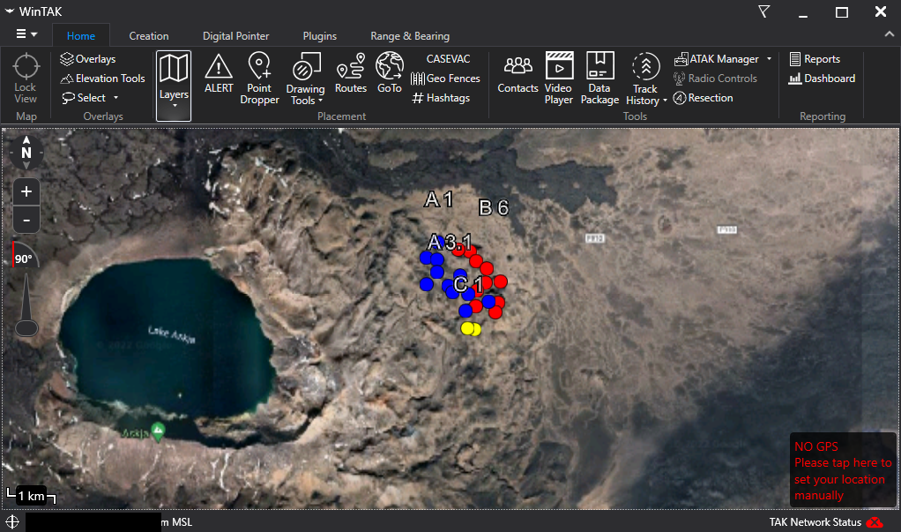

# taky-overwatch
A simple project which takes positional CoTs from a Client Server, and forwards it to a Master server. And changes the color in order to separate CoTs from multiple servers

## Project
https://github.com/Securitybits-io/taky-overwatch

## Docker Images
https://hub.docker.com/r/securitybits/taky-overwatch

## Tags
`latest` - is built on every code push

## Use
Set the environment variables according to your setupm, then download the docker-compose.yml from Project repo and adjust the zip URLs.

run `docker-compose up -d` to start the environment.

Overwatch _should_ be able to connect to any TAKServer as it relies on RAW CoTs, but only have been tested with TAKY.

#### Example dashboard

## Supported env variables
| Variable            | Type   | Default      | Example Input                           |
|---------------------|--------|--------------|-----------------------------------------|
| LOG_LEVEL           | STRING | INFO         | INFO, DEBUG                             |
| MASTERURL           | STRING | N/A          | https://example.com/atak-to-cert.zip    |
| CLIENTURL           | STRING | N/A          | https://example.com/atak-from-cert.zip  |
| COLOR               | STRING | Yellow       | example.com                             |

## Help Docs
- https://superfastpython.com/thread-queue/